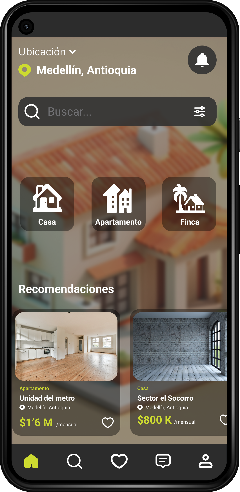
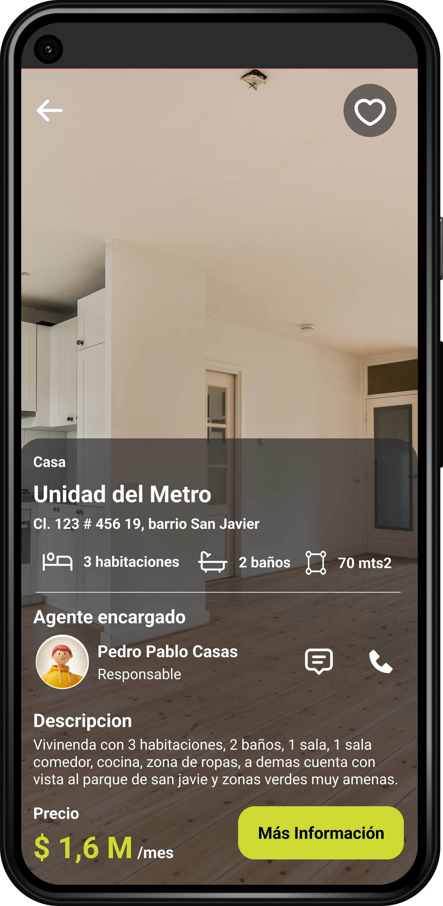
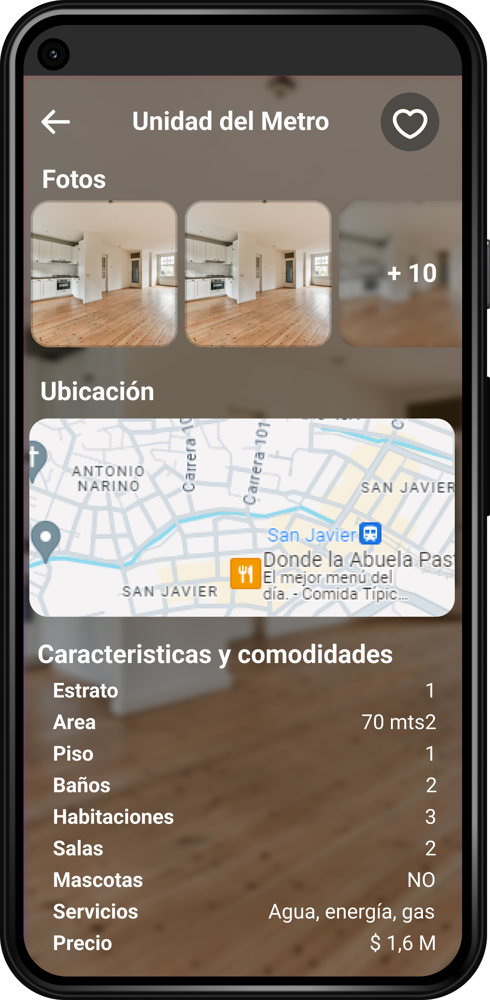
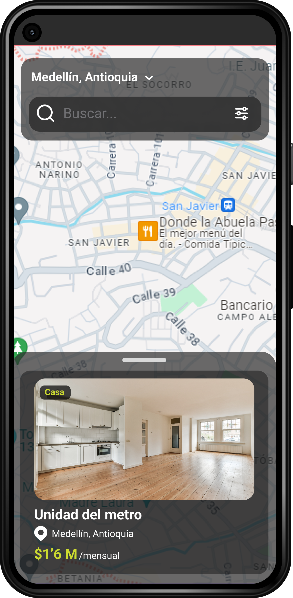
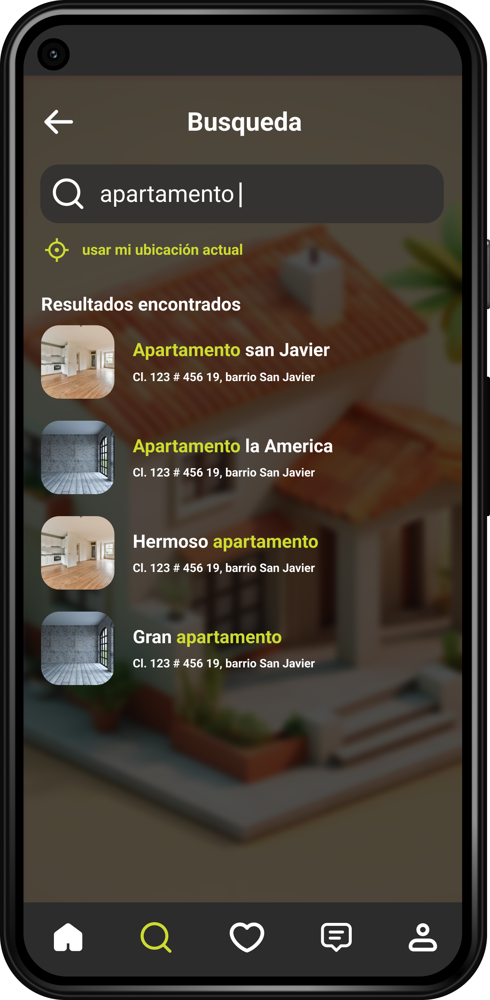

# Bienvenido a houseRental (ReactNative-Expo)

## Descripción
houseRental es una aplicación innovadora de alquiler de viviendas que simplifica y agiliza el proceso de búsqueda de propiedades. Con una interfaz intuitiva, filtros avanzados y características de seguridad integradas, houseRental está diseñado para hacer que el proceso de alquiler sea más accesible y eficiente.

## Características Principales
- **Exploración fácil**: Navega a través de una amplia gama de opciones de viviendas con un sistema de filtrado inteligente.
- **Interfaz amigable**: Una experiencia del usuario diseñada para ser intuitiva y agradable.
- **Gestión eficiente de propiedades**: Beneficios tanto para inquilinos como para propietarios.
- **Seguridad y confianza**: Verificación de identidad, evaluaciones de propiedades y pagos seguros.

## Capturas de Pantalla
|  **View de Home** |  **View de información** |  **View de mas información** |  **View de búsqueda** |
|---|---|---|---|
|  **View de Busqueda** |  **View de favoritos** |  **View de mensajes** |   **View para perfil** |

## Instalación
1. Clona el repositorio: `git clone https://github.com/alekanDev/houseRental.git`
2. Instala las dependencias: `yarn install`
3. Inicia la aplicación: `yarn expo start`
   
**NOTA:** Antes de iniciar el front tener en cuenta haber realizado el proceso del back y asi tener completamente funcional la plataforma.

## Contacto
Para preguntas o sugerencias, no dudes en ponerte en contacto con nosotros en alekandev@gmail.com o a través de la sección de Problemas en este repositorio.

¡Gracias por tu interés en houseRental!
